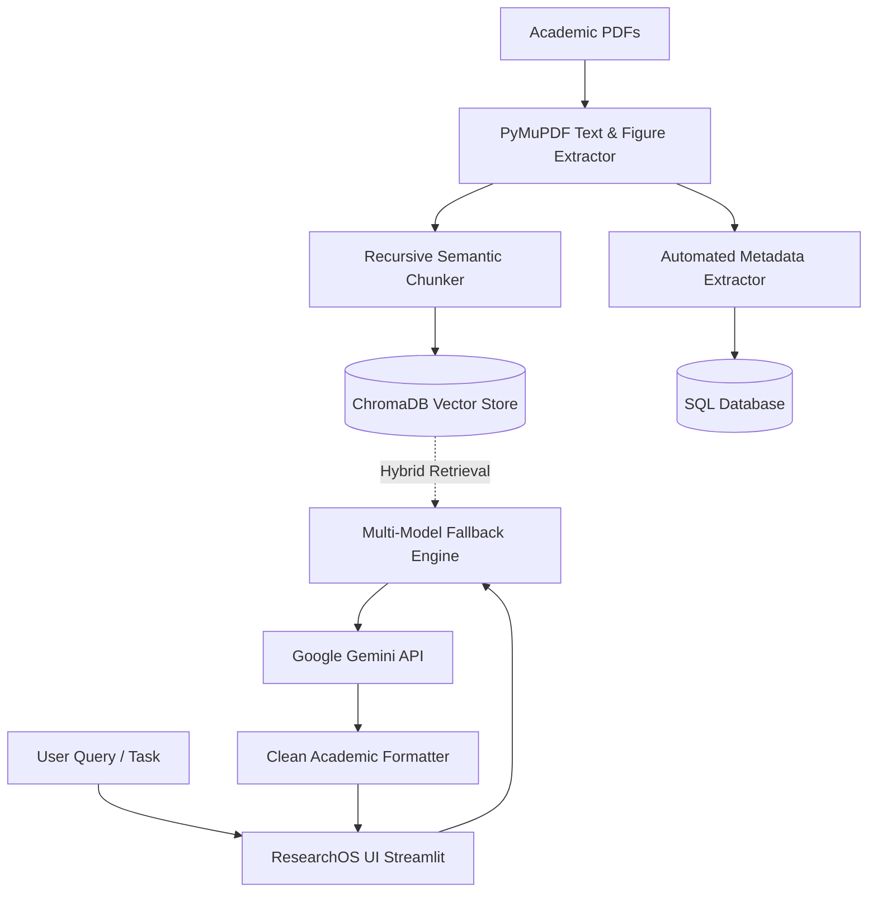

# 🔬 ResearchOS — The AI-Powered Academic Research Operating System

[](https://share.streamlit.io)
[](https://www.python.org/downloads/)
[](https://ai.google.dev/)
[](https://www.trychroma.com/)
[](https://opensource.org/licenses/MIT)

**ResearchOS** is a comprehensive, production-grade AI workspace designed for researchers, scientists, and engineers. It transforms raw academic PDFs into an interactive knowledge base with retrieval-augmented generation (RAG), automated LaTeX formula decomposition, multimodal figure inspection, and cross-paper comparative matrices.

---

## 🌟 Key Features

### 💬 1. Specialized Multi-Agent AI Chat (RAG)
- **Document-Grounded QA**: Chat with multiple research papers simultaneously with strict source citations and page numbers.
- **5 Autonomous Research Modes**:
  - 📖 **Literature Reviewer**: Synthesizes thematic taxonomies and related works.
  - 🔬 **Research Gap Detector**: Uncovers computational bottlenecks, unaddressed assumptions, and open questions.
  - 💡 **Novel Idea Brainstormer**: Generates publishable research hypotheses and empirical extensions.
  - 🧪 **Experiment Planner**: Designs benchmark protocols, baseline comparisons, and evaluation metrics.
  - ⚛️ **General Research Agent**: Authoritative explanations with mathematical rigor.

### 📑 2. Instant Academic Paper Summarizer
- Multi-tier synthesis protocols:
  - **Executive Summary**: Core breakthroughs & innovations.
  - **Technical Deep-Dive**: Mathematical formulations, objective loss functions, and algorithmic mechanics.
  - **Key Empirical Results**: Datasets, benchmarks, ablation studies, and numerical gains.
  - **ELI5 (Intuitive Overview)**: Clear, accessible analogies without dense jargon.
  - **Critical Gaps & Limitations**: Failure modes, scalability constraints, and future work.

### ⚖️ 3. Multi-Paper Comparative Intelligence
- Side-by-side comparative matrices across:
  - **Head-to-Head Architectural Showdown**
  - **Empirical Benchmarks & Ablations**
  - **Mathematical Objective Formulations**
  - **Novel Hybrid Synthesis** (Hypothesizes novel combinations of two papers)

### 📐 4. Mathematical Formula Explainer & Code Generator
- Extracts LaTeX equations directly from papers.
- Deconstructs variables, dimensions, and physical intuitions.
- Generates **executable PyTorch / NumPy implementation snippets** directly from mathematical notation.

### 🖼️ 5. Multimodal Figure & Diagram Vision Inspector
- Powered by Gemini Vision to analyze architectural diagrams, workflow schematics, and ablation plots.
- Explains data flows, tensor transitions, and empirical significance.

### 📚 6. Research Paper Library & Auto-Metadata Extraction
- Ingests PDF research papers with automatic extraction of:
  - Title, Authors, Publication Year
  - Abstract, Author Keywords, Research Domain
  - DOI, Journal / Conference Proceedings, Publisher

### 🌐 7. Citation Lineage & Interactive Graph Network
- Interactive NetworkX + Plotly graph visualization of citation flows, intellectual foundations, and conceptual descendants.

### 📝 8. Smart Personal Notes & Interactive Flashcard Quiz
- Markdown-based note-taking with AI polishing.
- Generates multi-choice test flashcards from papers with explanations to reinforce paper retention.

---

## 🏗️ Architecture & Tech Stack



- **Frontend & UI**: Streamlit with custom glassmorphic academic theme, KaTeX math formatting, and responsive containers.
- **LLM Orchestration**: Google Generative AI (`gemini-flash-lite-latest`, `gemini-3.5-flash-lite`, `gemini-3.5-flash`) with automatic rate-limit fallback.
- **Vector Storage**: ChromaDB with `all-MiniLM-L6-v2` SentenceTransformer embeddings.
- **Document Processing**: PyMuPDF (`fitz`), Pillow.
- **Relational Data**: SQLAlchemy (PostgreSQL / SQLite).
- **Data Visualization**: Plotly, NetworkX.

---

## 🚀 Quick Start (Local Setup)

### 1. Clone the Repository
```bash
git clone https://github.com/iamharshhhh/researchos.git
cd researchos
```

### 2. Create and Activate a Virtual Environment
```bash
# Windows
python -m venv venv
.\venv\Scripts\activate

# Linux / macOS
python3 -m venv venv
source venv/bin/activate
```

### 3. Install Dependencies
```bash
pip install -r requirements.txt
```

### 4. Configure Environment Variables
Create a `.env` file in the root directory:
```env
GEMINI_API_KEY="your_google_gemini_api_key_here"
DATABASE_URL="sqlite:///data/researchos.db"
```

> **🔑 Get a Free Gemini API Key**: [Google AI Studio](https://aistudio.google.com/)

### 5. Launch ResearchOS
```bash
streamlit run app.py
```
Open your browser at `http://localhost:8501`.

---

## ☁️ Deployment Guide (Streamlit Community Cloud)

1. Fork or push this repository to your GitHub account.
2. Go to [share.streamlit.io](https://share.streamlit.io/) and click **"New app"**.
3. Select your repository: `iamharshhhh/researchos`, Branch: `main`, Main file path: `app.py`.
4. Click **Advanced Settings** → **Secrets** and add:
```toml
GEMINI_API_KEY = "your_google_gemini_api_key_here"
```
5. Click **Deploy**! 🚀

---

## 📁 Project Structure

```text
researchos/
├── app.py                     # Main application entry point & authentication
├── requirements.txt           # Python dependencies
├── sync.bat                   # 1-click Windows Git sync utility
├── .streamlit/
│   └── config.toml            # UI theme and server configuration
├── backend/
│   ├── config.py              # App config, model fallbacks & environment variables
│   ├── database.py            # SQLAlchemy models & CRUD operations
│   ├── db.py                  # ChromaDB vector store & lazy embeddings
│   ├── document_processor.py  # PDF text extraction & AI metadata parser
│   └── rag_pipeline.py        # RAG pipeline, fallback generation & table healer
├── data/
│   └── papers/                # Local PDF storage directory
└── views/
    ├── dashboard.py           # Research hub & statistics
    ├── papers/
    │   ├── upload.py          # PDF upload & batch ingestion
    │   └── library.py         # Paper repository & metadata viewer
    ├── ai/
    │   ├── chat.py            # Multi-agent RAG conversational interface
    │   ├── summarize.py       # Multi-protocol academic paper summarizer
    │   └── compare.py         # Cross-paper comparative intelligence
    ├── tools/
    │   ├── formula.py         # LaTeX formula deconstructor & PyTorch generator
    │   ├── figure.py          # Multimodal figure & diagram analyzer
    │   ├── citation.py        # BibTeX, APA, IEEE citation generator
    │   └── quiz.py            # AI flashcard quiz generator
    └── other/
        ├── notes.py           # Academic notes organizer
        ├── semantic_search.py # Multi-document semantic search
        └── citation_graph.py  # Interactive citation network visualization
```

---

## 📄 License

Distributed under the MIT License.
